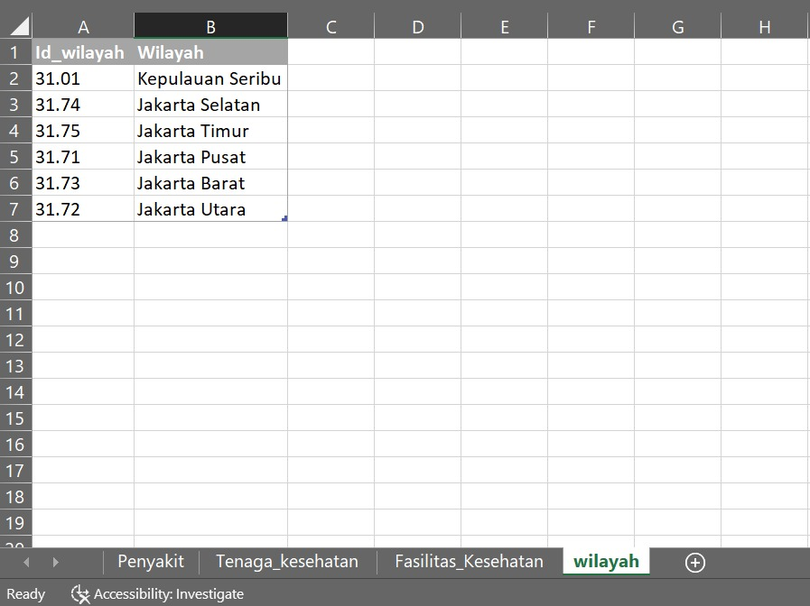
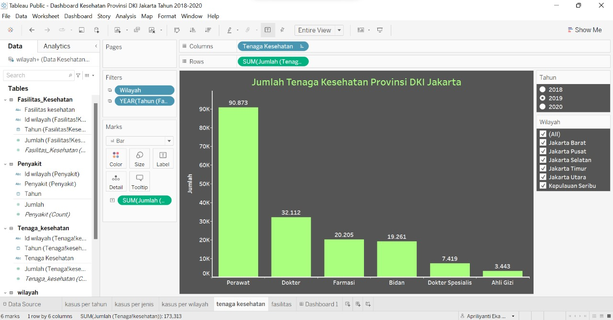

<!-- ABOUT THE PROJECT -->
## Pembangunan Dashboard Kesehatan Provinsi DKI Jakarta Tahun 2018-2020

<a href="https://public.tableau.com/views/DashboardKesehatanProvinsiDKIJakartaTahun2018-2020/Dashboard1?:language=en-US&:display_count=n&:origin=viz_share_link">
    

Dashboard visualisasi ini dilakukan dengan tujuan agar dapat menampilkan informasi jumlah kasus penyakit yang terjadi di Provinsi DKI Jakarta. Serta agar dapat menampilkan informasi ketersediaan fasilitas kesehatan dan tenaga kesehatan yang ada di Provinsi DKI Jakarta. 

 

Berikut ini merupakan tahapan yang dilakukan dalam membuat dashboard dengan menggunakan software tableau :
* Mengumpulkan Data 
* Cleaning Data
* Membuat workbooks baru pada tableau
* Mengimport data yang akan digunakan 
* Menentukan field yang akan menjadi sumber nilai
* Membuat tampilan dashboard berdasarkan informasi yang akan dibutuhkan.

Use the `BLANK_README.md` to get started.

(<a href="#top">back to top</a>)

<!-- GETTING STARTED -->
## Proses pembuatan dashboard

Pembuatan dashboard dimulai dari pengumpulan data hingga mengimplementasikannya pada tableau.

 

### Pengumpulan Data

Tahapan pengumpulan data dilakukan dengan mencari data pada bidang kesehatan. Data yang digunakan berasal dari website [data.jakarta.go.id](https://data.jakarta.go.id/). Data yang digunakan yaitu data jumlah kasus penyakit, fasilitas kesehatan, serta tenaga kesehatan menurut Kabupaten/Kota di Provinsi DKI Jakarta pada tahun 2018-2020. 

Dataset pertama yang digunakan adalah data dengan variabel Id_wilayah sebagai variabel yang menjelaskan kode wilayah dan variabel wilayah yang menjelaskan nama Kabupaten/Kota di Provinsi DKI Jakarta.

 

Kemudian menggunakan dataset Jumlah kasus penyakit menular menurut jenis penyakit DKI Jakarta tahun 2018-2020 dengan variabel wilayah, jenis penyakit, dan jumlah orang yang terkena penyakit. Jenis penyakit yang terdapat dalam data yaitu penyakit malaria, TB paru, pneumonia, kusta, campak, diare, DBD, AIDS kasus baru, AIDS kasus kumulatif, IMS.

 

Dataset yang selanjutnya adalah data jumlah tenaga kesehatan menurut Kabupaten/Kota DKI Jakarta tahun 2018-2020. Variabel yang digunakan adalah variabel wilayah, jenis tenaga kesehatan dan jumlah tenaga kesehatan berdasarkan jenisnya. Jenis tenaga kesehatan yang terdapat dalam data yaitu dokter, perawat, bidan, farmasi, dan ahli gizi.

 

Dataset yang selanjutnya adalah data jumlah fasilitas kesehatan menurut Kabupaten/Kota DKI Jakarta tahun 2018-2020. Variabel yang digunakan adalah variabel wilayah, jenis fasilitas kesehatan dan jumlah fasilitas kesehatan berdasarkan jenisnya. Jenis fasilitas kesehatan yang terdapat dalam data yaitu rumah sakit, puskesmas kecamatan, dan puskesmas kelurahan.

 

### Cleaning Data
Setelah data dikumpulkan lalu dilakukan cleaning data yaitu membuang duplikasi data, memeriksa data yang tidak konsisten, serta memperbaiki kesalahan pada data.

 

### Mengimport data ke tableau

Langkah selanjutnya adalah mengimport data yang sudah di cleaning ke dalam tableau untuk divisualisasikan. Langkah untuk mengimport data pada tableau yaitu dengan meimilih New Data Source, lalu pilih data yang akan di import. 

### Membuat visualisasi 
Langkah yang selanjutnya adalah membuat grafik yang sesuai dengan field yang akan yang akan menjadi sumber nilai.

 

Pertama, membuat grafik jumlah kasus penyakit menular per tahun. Yaitu membuat grafik line dengan variabel tahun sebagai kolom dan variabel jumlah orang sebagai baris. Kemudian diberikan filter untuk menyaring data berdasarkan jenis penyakit.

 

Grafik yang selanjutnya dibuat adalah grafik jumlah kasus penyakit per jenis penyakit. grafik yang digunakan adalah grafik batang dengan variabel jenis penyakit sebagai baris dan variabel jumlah orang sebagai kolom. Kemudian diberikan filter untuk menyaring data berdasarkan tahun. 

 

Kemudian membuat grafik jumlah kasus penyakit per Kabupaten/Kota.  grafik yang digunakan adalah grafik batang dengan variabel wilayah sebagai baris dan variabel jumlah orang sebagai kolom. Kemudian diberikan filter untuk menyaring data berdasarkan tahun.

 

Selanjutnya membuat grafik jumlah tenaga kesehatan. garfik yang digunakan yaitu grafik batang dengan variabel jenis tenaga kesehatan sebagai kolomd dan variabel jumlah tenaga kesehatan sebagai baris. kemudian diberikan filter untuk menyaring data berdasarkan wilyah dan tahun.

 

Kemudian, membuat grafik persentase jumlah fasilitas kesehatan. Grafik yang digunakan adalah pie chart. Dengan label ditengah chart yang mengidentifikasikan jumlah fasilitas. Variabel yang digunakan yaitu variabel jenis fasilitas kesehatan. kemudian diberikan filter untuk menyaring data berdasarkan tahun dan wilayah. 

 

Langkah selanjutnya adalah membuat dashboard dan menyusun grafik-grafik yang telah dibuat sebelumnya ke dalam dashboard. 

 

## Implementasi

  

Berdasarkan dashboard tersebut pengguna dapat melihat perkembangan jumlah kasus penyakit antara tahun 2018-2020 di Provinsi DKI Jakarta dan dapat melihat informasi kasusnya berdasarkan jenis penyakitnya. Kemudian pengguna juga dapat melihat jumlah kasus yang terjadi antara dengan pilihan tahun antara 2018-2020 berdasarkan wilayah dan jenis penyakitnya. Sehingga pengguna dapat membandingkan wilayah mana denga jumlah kasus tertinggi dan jenis penyakit apa yang paling banyak diderita. Selain itu, pengguna juga dapat melihat informasi jumlah tenaga kesehatan dan persentase jumlah fasilitas kesehatan berdasarkan wilayah dan tahun. 

